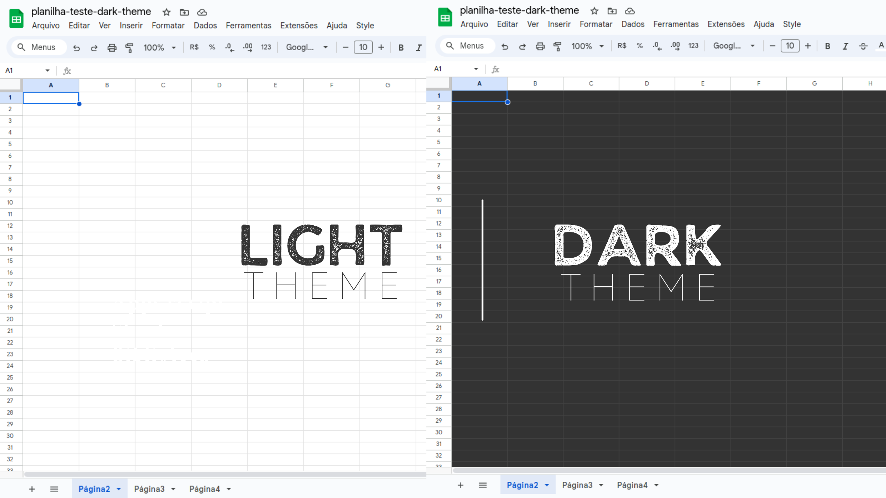

<h1>
  Mode Dark Theme Sheets
  <span style="float: right;">
    
    
    
  </span>
</h1>

### Simulador de theme Dark no google sheets

<br />
<span style="text-align: center; display: block;"> 

</span>
<br />

A fadiga ocular causada pelo brilho intenso das planilhas do Google Sheets é um problema comum para muitos usuários. 😕 Para solucionar essa questão, desenvolvi código que simula o modo escuro, proporcionando uma experiência visual mais agradável e reduzindo o cansaço visual. 🤓 Com ele, você pode personalizar células, linhas e abas com temas escuros, adaptando o ambiente do Google Sheets às suas preferências."

Para facilitar ainda mais o acesso ao modo escuro no Google Sheets, criei uma biblioteca que pode ser utilizada por qualquer pessoa, tornando a experiência de uso mais agradável e acessível.

# Id da biblioteca
``` Id Biblioteca

19cmuT4SgaHgWDDF-lUGcbHsQlWQtmKXhn21Tqxt4TnIfSNrwuN1X0Lxl

```
# Funções


```javascript
function onOpen() {  
  darkthemesheets.onOpen()
}  
function setDarkModeForAllSheets() {  
  darkthemesheets.setDarkModeForAllSheets()
}  
function setLightModeForAllSheets() {  
  darkthemesheets.setLightModeForAllSheets()
}
```
<br />
<a href="https://youtu.be/IyJ3PcljwEQ" target="_blank">Clique aqui para assistir ao vídeo de como usar a biblioteca</a>
<br />

# Instalando a biblioteca
- Copie o ID do projeto, que é uma sequência de caracteres
    - você encontrará o ID nesta página.
- Adicione a biblioteca ao seu projeto
    - Abra a planilha do Google Sheets onde você deseja usar a biblioteca.
    - Vá em "Extensões" > "Apps Script".
    - No editor de scripts, clique em "+ Adicionar uma biblioteca" no menu lateral.
    - Cole o ID do projeto copiado anteriormente no campo "ID do script".
    - Clique em "Pesquisar".
    - Selecione a versão mais recente da biblioteca no menu suspenso.
    - Clique em "Adicionar".

# Utilize as funções da biblioteca
- Copie as funções onOpen() setDarkModeForAllSheets() setLightModeForAllSheets()
    - você encontrará nesta nesta página.
- Agora você pode usar as funções da biblioteca em seu script. 
    - Cole as funções copiadas no script.
    - Para que a função seja executada automaticamente ao abrir a planilha, você precisa executar a função onOpen() uma vez. Isso ativará o gatilho onOpen, que executará a função sempre que a planilha for aberta.

<br />


# Tecnologia e requisitos

O `darkthemesheets` foi desenvolvido utilizando **JavaScript** com o **motor V8** no **Apps Script**, proporcionando máximo desempenho e compatibilidade com recursos modernos da linguagem. Para facilitar o desenvolvimento e a integração com o Apps Script, utilizamos o **VS Code** como editor de código e o **clasp** como ferramenta de linha de comando para gerenciar o projeto. O projeto foi desenvolvido utilizando a versão **v21.7.1 do Node.js**.

As seguintes dependências também foram utilizadas no desenvolvimento:

```json
"devDependencies": {
   "@google/clasp": "^2.4.2",
   "@types/google-apps-script": "^1.0.84"
 }
```
<br />

### Agradecimentos

Obrigado por usar o `darkthemesheets`! 😊 Espero que esta biblioteca ajude você a ter uma experiência mais agradável com o Google Sheets.

Sinta-se à vontade para contribuir com o projeto! Se você encontrar algum problema, tiver sugestões de meliorist ou quiser adicionar novas funcionalidades, fique à vontade para abrir uma _issue_ ou enviar um _pull request_ no repositório do projeto. 🤝

## Autoria

<h1>
  Emerson Maia | Expert Google
  <span style="float: right;">
    
  </span>
</h1>

